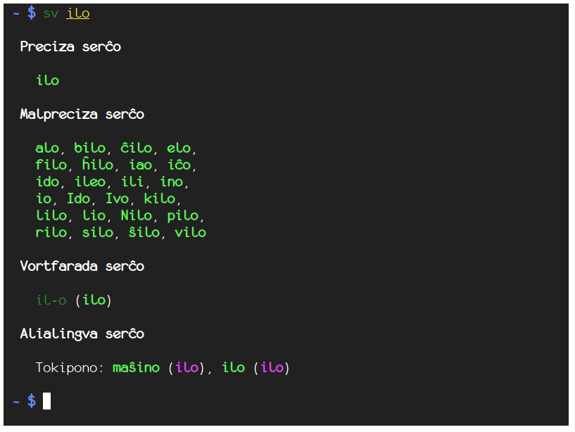
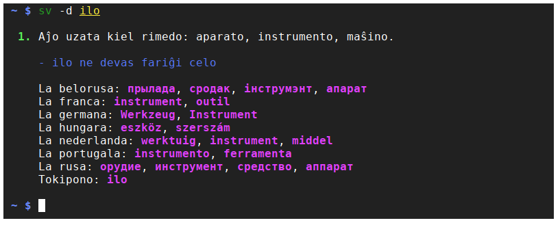

# simpla_vortaro

`simpla_vortaro` is a Rust crate which provides access to the Esperanto dictionary [Simpla Vortaro](http://www.simplavortaro.org/) as command line tool (`sv`) or as library.

## [API Documentation](https://docs.rs/simpla_vortaro)

## Screenshots





## Installation of `sv` from source

```
cargo install simpla_vortaro
```
